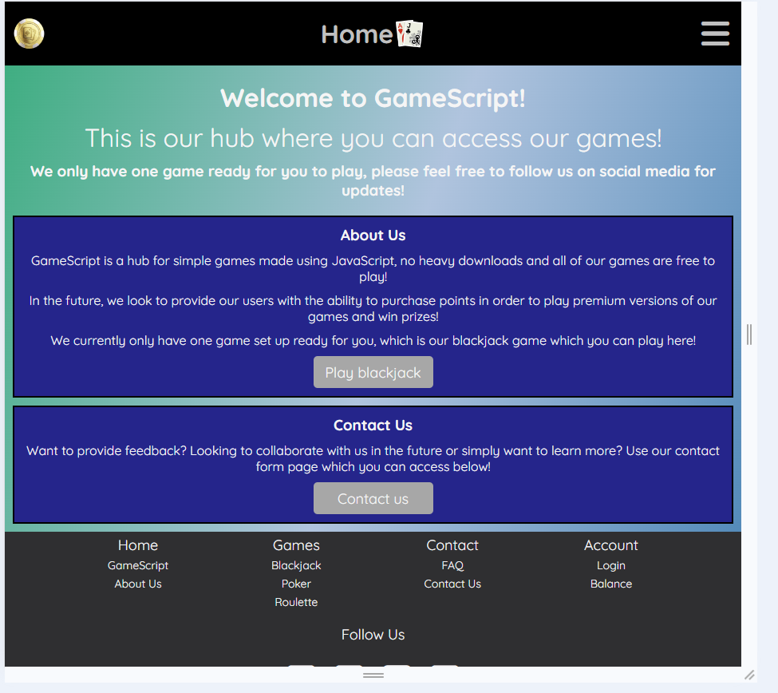
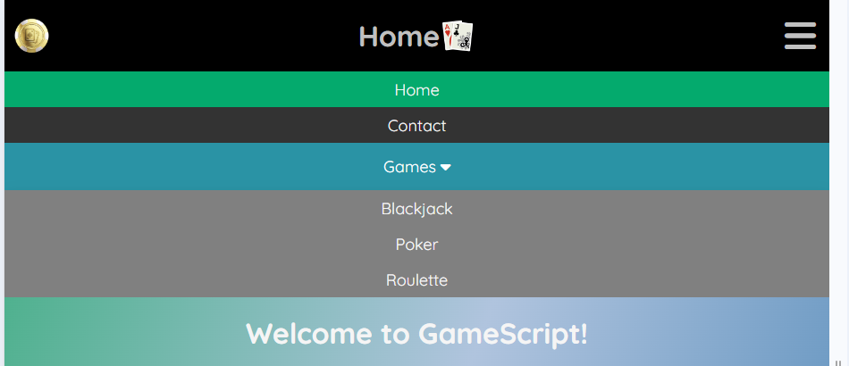
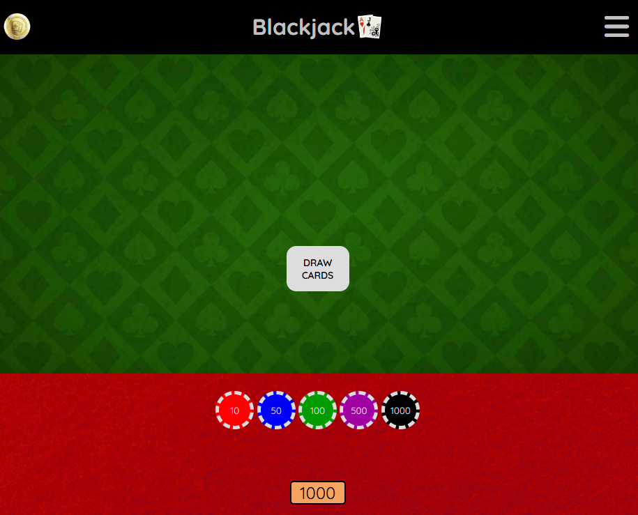
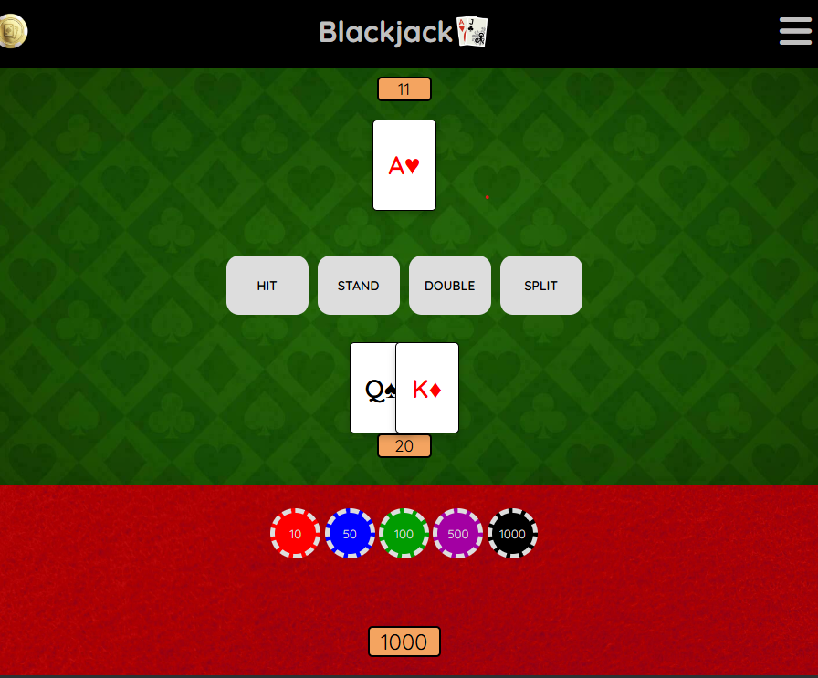
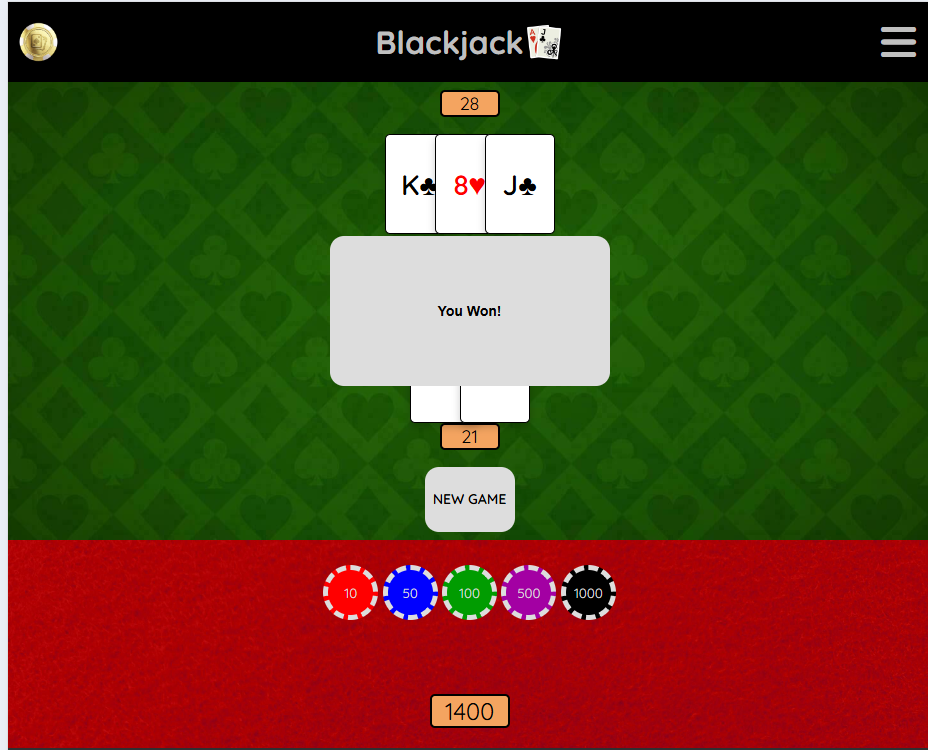
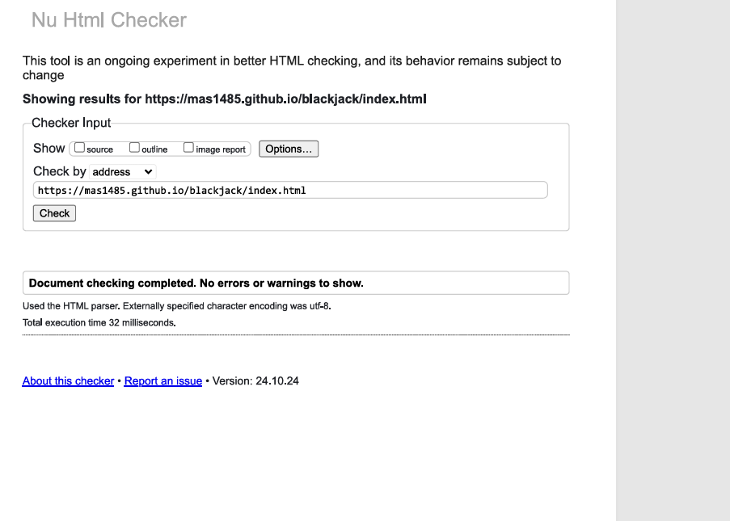
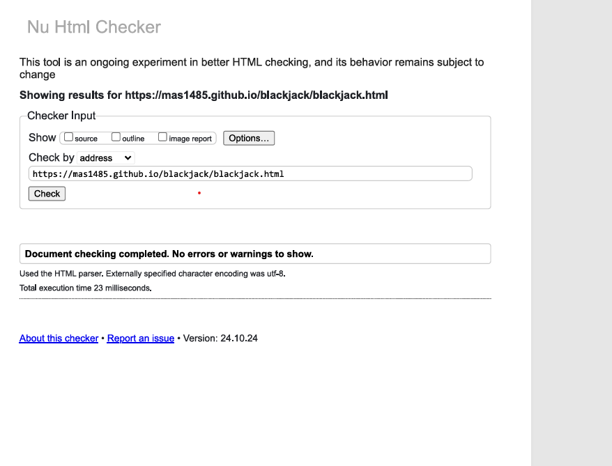
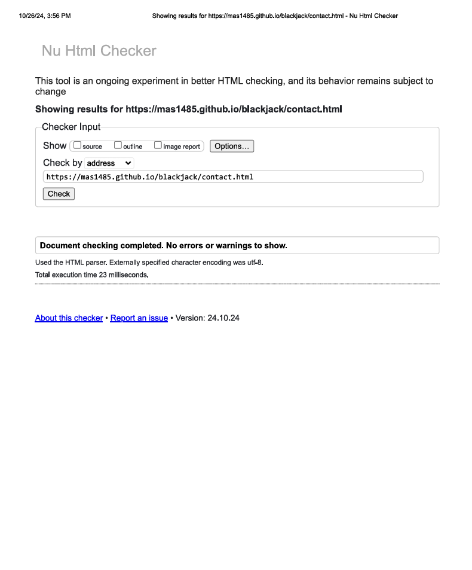
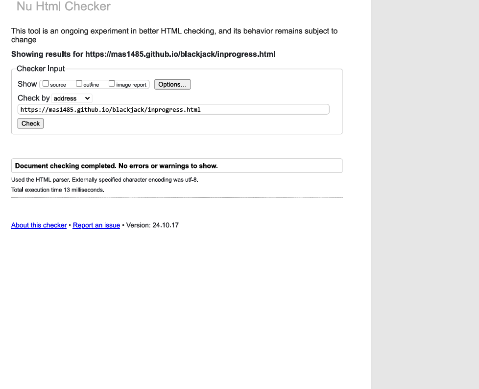
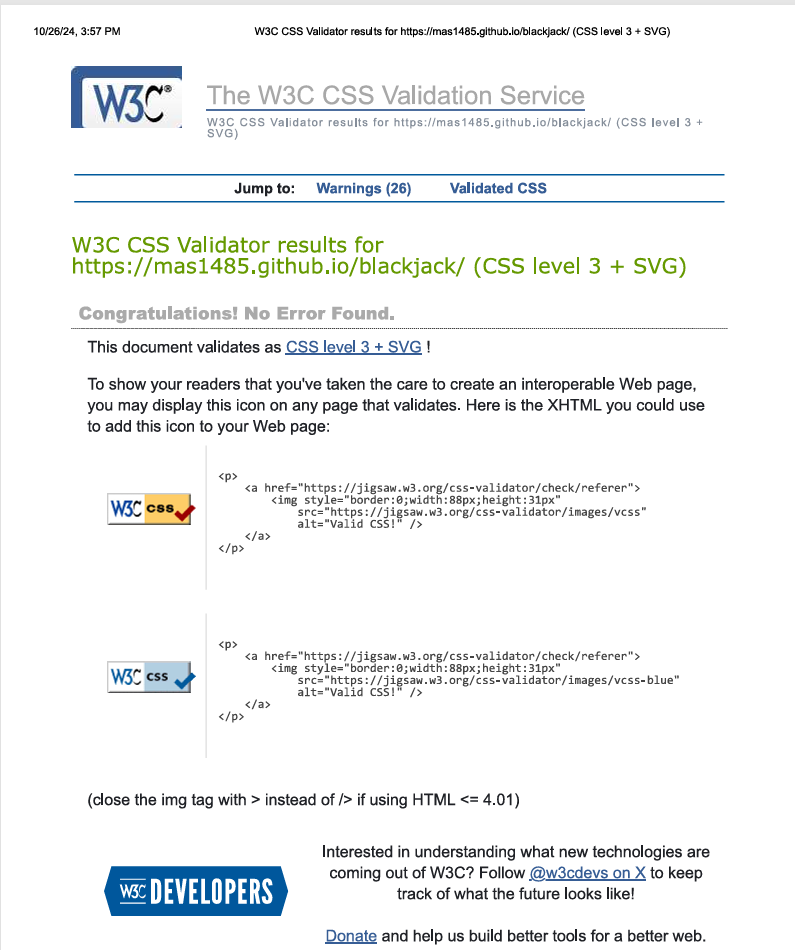

# Welcome to my Project Two Blackjack Game

##Blackjack

My project for the course is a blackjack game which uses HTML, CSS and JavaScript, I wanted to make a simple game which could show the potential of on online game used by professionals. Whilst the blackjack game itself is not named, I have named the *'hub'* that the game sits in as GameScript, the user should see a little about the site on the index/home page and there is the beginnings of a site which could host a number of other games with the identity of being a pure script only game.

GameScript would aim to be a free platform for games *however* users would be able to login to their account and make premium purchases (although this is not yet implemented due to being a short project focusing only on the blackjack game).

Just a few announcements before you continue;

The rules of blackjack vary, I am using the rules I know going to the casinos in my local areas, including London, so think of it as a European styled blackjack game.

I have added images of the site, however I can only display some in black/white.

The main focus of the site is the blackjack game, the other pages are a simple design and there is not much else to discuss.

If you want to see the code, look at it in the script or blackjack in js.

If you want to see my commit history for how development took place, just bear in mind that I use fork so I have subjects aswell as descriptions. I also a full-time as a business consultant working on a *supposed* part-time course so commits may be varied in regularity as expected.

##GameScript Homepage

This is the homepage of the hub that the game sits in, as the focus was on the game, this was just to show how the blackjack game would be accessed and give the user an idea of the practical element of the game, as part of a wider online community of games, whether linked to gambling or for more casual players.

##Features

###NavBar

This is the NavBar, whilst there is not alot of content on it, the user can see where the potential for growth is, the nav bar also contains a *Mega-Menu* which is a dropdown section allowing the user to however over *games* in the list and this will drop down a further menu based on the potential games. This was made by using all the tools at my disposal and I took the idea from W3schools and tweaked it to match my needs. Url is https://www.w3schools.com/howto/howto_css_mega_menu.asp

###Blackjack

This is the Blackjack game, the style is simple yet the user gets a feeling they are at a table, the green background with the red felt and the chips in various appropriate colors.

The first thing a player needs to do is decide to bet, to bet, they need to click the chip(s) they want to use to bet, the player starts at 1000 indicated by the score, however in future this will reflect the *balance* in a players account if they want to actually gamble. To simply play the game without a bet, just click the button *drawcards* without clicking any chips. As in real-life casino, all bets are final and the player cannot retract a bet. Maybe in the future depending on user experience this can change but I wanted the game to feel as if you were at a table.

If a bet is made the pot appears with the amount bet by the player. The score is updated as the bet amount is placed.

###Dealing Cards

When the game starts, two cards are dealt to the player and two to the dealer, I used an array in JS to create objects for each card and the computer will randomly select a card to deal, this will also prevent the card from being *redrawn* so there are no duplicates and the cards are no longer in the deck until they are shuffled back in when a newgame is started. The player can only see one of the dealers cards and there are trackers for the scores to help the user see the dealers score (only the known cards are calculated) and their own score.

I have also allowed the four controls a player can take during a blackjack game, such as *hit*, *stand*, *double* and *split*. Each working as the player would expect and the buttons only appear when they are available to do so, the player cannot bet more than they have, so they cannot double if they don't have the funds (refresh the page to reset the score, this will be inplace until options to play for actual money would be setup but for now, no such immediate plans).

The cards are also slightly interactive, the player can hover over them and feel as though they are *picking* up the card. This uses basic css styling to make it appear bigger from the other cards. The (first) ace is also treated as either an 11 or a 1 (with simple logic removing 10 from the sum if the hand contains an ace and goes over 21).

###Playing the Dealers turn

The dealer makes moves based on the players score and whether or not the dealer has the same score, better or worse. Once the dealer has *finished* their turn, the game checks to see who won and an alert is displayed, the user can click anywhere to remove the alert.

The score is updated and if the player wins, the pot is added to the score alongside the original bet. The player can then choose to play again and see if they fare better (or *worse!*).

See how I did for an example.

So I put 200 into the pot by clicking the 100 chip twice. I got a score of 21 and doubled my bet, the dealer then hit to see if he could match but went over. I got the alert and my score updated from 1000 to 1400 as I bet 400 total.

##Future of the game

On a smaller scale I would make the chips more interactive, maybe by clicking them they enter the pot themselves so the user sees a pot of the chips they actually used and vice versa see their own score reduce by an amount.

I would also style the cards to allow you to see the deck, the back of the cards (second card of dealer is then shown on the table face down) and make them appear as if they are being dealt from the deck.

On a larger scale I would implement the other pages to actually allow users to sign in, provide feedback, a payment system to allow users to play with their own funds and earn winnings.

Other games, either following the casino style, or other styles could be added with their own sections/subsections in the NavBar.

##Testing

Yes, I tested the game. Fairly obvious if you want to look at the commit history, there are various bug fixes and I played the game manually to check that my code works as I am building this from scratch and this is my second website, the first being project one. I have a *long* and *rich* history of coding stretching as far back as 3 months from today, despite this I tested my code locally using dev tools to make sure my site was being set up as I wanted it to and made commits when I believed I accomplished my goal, achieved a milestone or when I had to stop and get on with my *fulltime* job aswell as my day-to-day life. I am not going to go through every bug fix as this is a waste of my time. If you want to see one, look up bugfix in the commit history. Takes about the same time as me explaining it. These fixes are only the recorded ones that were made to fix issues when I already submitted the code, unless you want me to video record myself working in the future to show me working on this and if you want to see all the bug fixes/changes I made, you'll have to accept this.

I also put my site through the validator see below. 
The *warnings* in JS are about extensions but the code runs fine and no issues with syntax or functions.

I am not aware of any unfixed bugs.

##Deployment

The site was deployed to GitHub pages. The steps to deploy are as follows:
In the GitHub repository, navigate to the Settings tab
From the source section drop-down menu, select the Master Branch
Once the master branch has been selected, the page will be automatically refreshed with a detailed ribbon display to indicate the successful deployment.
The live link can be found here - https://mas1485.github.io/blackjack/index.html

##Credits

Other than W3 schools and whatever I could learn from the course, the code is mine from scratch. I used the template examples from w3 schools/codeinstitute and tweaked then to work for my code. No credit and no references needed for the code itself.

I obtained the assets, such as the backgrounds and to icons from google images public domain, they are not trademarked and I typed in a generic search request such as *goldcoinpng*.

Icons obtained from fontawesome at https://fontawesome.com/